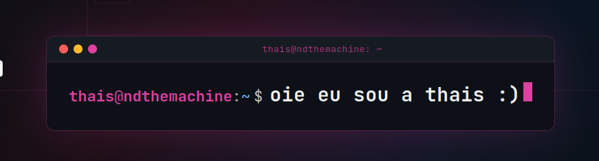

  

# 🎓 estudante de ciência de dados na UFMG

📊 Interessada em análise de dados, estatística, álgebra linear computacional e segurança da informação.

## 🧠 Atualmente estudando

- Estruturas de Dados e Algoritmos
- Banco de Dados e SQL
- Estatística para Ciência de Dados e análise exploratória de dados (EDA)
- Álgebra Linear Computacional
- Fundamentos de Segurança da Informação

---

## 🛠️ Tecnologias

### Linguagens

  
  
  

### Dados e Banco de Dados

  
  
  

### Ferramentas

  
  
  

---

## 📌 Repositórios em Destaque

*   **[Kryptolock] Gestão Segura de Credenciais** | *C++, SFML, SQLite*
*   
    Aplicação desktop para gerenciamento de senhas, com interface gráfica, implementando persistência de dados e algoritmos criptográficos.

*   **Análise de Impacto do PIX na economia brasileira** | *SQL*
*   
    Investigação analítica de bases de dados públicas por meio de queries estruturadas para avaliar a adoção e o impacto financeiro do sistema.

*   **Pipelines de Análise Exploratória (EDA)** | *Python, Pandas, Jupyter*
*   
    Tratamento, higienização e modelagem visual de conjuntos de dados visando a extração de métricas e insights estatísticos.

*   **Otimização de Estruturas de Dados** | *C++*
*   
    Implementação e avaliação de algoritmos de ordenação, grafos e outras estruturas de dados, com análise de complexidade e gerenciamento de memória.
    
*   **Desenvolvimento de Jogos** | *Python, Pygame, C, Allegro*
*   
    Projetos voltados ao estudo de lógica de programação, orientação a objetos e programação gráfica 2D.

---

## 📫 Contato

💼 LinkedIn: [linkedin.com/in/thais-sa](https://www.linkedin.com/in/thais-sa)

📬 Email: **sathaisr@gmail.com**

---

thais@ndthemachine:~$ exit

